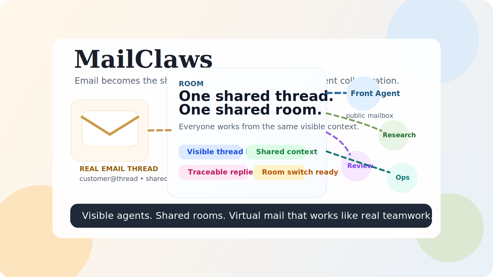

# MailClaws

<p align="center">
  邮件通信的多智能体。协作可见。可追溯、可共享、更轻的上下文。
</p>

<p align="center">
  <a href="./README.md">English</a> ·
  <a href="./README.zh-CN.md"><strong>简体中文</strong></a> ·
  <a href="./README.fr.md">Français</a>
</p>

<p align="center">
  <a href="https://dangozhang.github.io/mailclaw/">网站</a> ·
  <a href="https://github.com/dangoZhang/mailclaw/actions/workflows/ci.yml">CI</a> ·
  <a href="https://github.com/dangoZhang/mailclaw/actions/workflows/release.yml">Release</a>
</p>

<p align="center">
  
</p>

MailClaws 把邮件作为 Openclaw 多智能体运行时的通信方式。

它特别适合：

- 以邮件来工作的人
- Openclaw用户
- 长线程对话
- 高频切换不同会话
- 需要先汇报进度、再给最终答案的工作
- 想用多个智能体协作，但又不想丢掉上下文控制权的团队

## 为什么它对用户更友好

很多工具把协作藏起来。MailClaws 把协作直接展示出来，而且让你能控制。

- 你能以发送邮件的方式直接接入，无需多余配置。
- 你能在长时间任务后收到邮件。
- 你能看到完整的报告。
- 你能看到多智能体怎么共享信息。
- 和原生Openclaw一致的体验和能力


## 为什么邮件天然适合

邮件本来就有对的形状。

- 上下文边界清楚
- 历史天然可追溯
- 线程天然可共享
- 单条消息字数合适
- 完全符合工作习惯
- 不需要额外配置新协议

我们早就习惯在邮件里工作。MailClaws 直接从这里开始。

## 你真正会得到什么

- 一个公开智能体可以守住前台邮箱，多个专门智能体在背后协作。
- 内部协作不会隐藏，每个智能体都有虚拟邮箱、协作线程和可回看的内部邮件。
- 长线程消耗token更少：智能体不会一直保存上下文，而是会保存邮件
- 多智能体消耗token更少：多个智能体间通过邮件来共享背景信息和交流成果
- 用房间来管理ACK、进度汇报、审阅、审批、最终外发。
- Workbench 里能看到谁收到了什么、谁回了什么、哪版草稿胜出、哪里被拦下。
- 短期 subagent 只负责计算，不偷走长期人格；常驻智能体才拥有自己的 `SOUL.md`、邮箱和记忆边界。

## 任选一种安装方式

```bash
npm install -g mailclaws
```

```bash
pnpm setup && pnpm add -g mailclaws
```

```bash
brew install mailclaws
```

也可以直接运行仓库内的 `./install.sh`。

## 三分钟跑通，让智能体发给你第一封邮件

```bash
./install.sh
MAILCLAW_FEATURE_MAIL_INGEST=true mailclaws
```

再开一个终端：

```bash
mailclaws onboard you@example.com
mailclaws login
mailclaws dashboard
```

然后这样体验：

1. 登录任意一个你已经在用的邮箱。
2. 用另一个邮箱给它发一封测试邮件。
3. 打开工作台，点击 `Mail`。
4. 看这条房间出现、内部协作发生、回复链逐步形成。
5. 让智能体通过受治理的外发链路，给你发来第一封真正的回信。

如果你想先看一个安全的本地演示，运行 `pnpm demo:mail`，然后打开 `http://127.0.0.1:3020/workbench/mail`。

## 如果你已经在用 OpenClaw

- 保留原来的 Gateway 和 Workbench 使用习惯。
- 运行 `mailclaws dashboard`，登录后直接点击 `Mail` 标签。
- 原来的工作台体验不需要重学，MailClaws 只是把邮件、房间和多智能体协作接进来。
- 想直接打开邮件页，也可以运行 `mailclaws open`。

## 快速上手模板

用熟悉的模版来尝试多智能体能力：更快开工。

- `One-Person Company`：前台收件，后台分工，适合一人团队或很轻的前后台协作形态。它参考了 <https://github.com/cyfyifanchen/one-person-company> 的经营方式，但在 MailClaws 里被落成了真正的常驻角色编制。
- `Three Provinces, Six Departments`：三省六部制，体验赛博皇帝，更强的审阅、治理和执行编制，角色结构对齐 <https://github.com/cft0808/edict>。

在此编辑你的模版：

- <https://github.com/dangoZhang/mailclaw/blob/main/src/agents/templates.ts>


## 网站与工作台

- 网站：<https://dangozhang.github.io/mailclaw/>
- 工作台：运行 `mailclaws dashboard`，登录后点击 `Mail`

欢迎前往了解更详细的概念信息和使用方式。  

## 许可

MIT。见 [LICENSE](./LICENSE)。
